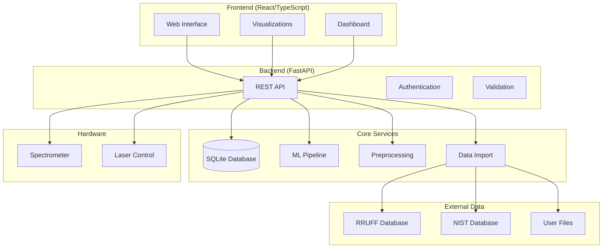

# Tonkatsu-OS: AI-Powered Raman Molecular Identification Platform

<div align="center">


[](https://github.com/patrickisgreat/tonkatsu-os)
[](LICENSE)
[](https://python.org)
[](https://typescriptlang.org)

**A comprehensive, open-source platform for DIY Raman spectroscopy with advanced AI-powered molecular identification capabilities.**

[🚀 Quick Start](#quick-start) • [📖 Documentation](#documentation) • [🔧 Installation](#installation) • [🎯 Features](#features) • [🤝 Contributing](#contributing)

</div>

---

## 📋 Table of Contents

- [Overview](#overview)
- [Key Features](#key-features)
- [Architecture](#architecture)
- [Installation](#installation)
- [Quick Start](#quick-start)
- [User Guide](#user-guide)
- [API Documentation](#api-documentation)
- [Development](#development)
- [Hardware Integration](#hardware-integration)
- [Database Management](#database-management)
- [Machine Learning](#machine-learning)
- [Troubleshooting](#troubleshooting)
- [Contributing](#contributing)
- [License](#license)

---

## 🎯 Overview

Tonkatsu-OS transforms DIY Raman spectroscopy by combining professional-grade signal processing with cutting-edge machine learning. Originally designed for repurposed B&W Tek spectrometers, it has evolved into a comprehensive platform that makes advanced molecular identification accessible to researchers, educators, and enthusiasts.

### What Makes Tonkatsu-OS Special

- **🤖 AI-First Approach**: Ensemble machine learning models (Random Forest, SVM, Neural Networks) for robust molecular identification
- **🔄 Automated Data Integration**: One-click download and integration of public databases (RRUFF, NIST)
- **🎨 Modern Interface**: React/TypeScript frontend with FastAPI backend for professional user experience
- **📊 Advanced Analytics**: Interactive visualizations, confidence scoring, and uncertainty quantification
- **🔧 Hardware Agnostic**: Works with existing hardware or in demo mode with synthetic data
- **📈 Scalable Architecture**: Built for everything from educational demos to research-grade analysis

---

## ✨ Key Features

### 🔬 **Spectral Analysis Engine**
- **Advanced Preprocessing**: Cosmic ray removal, baseline correction (ALS), noise reduction
- **Peak Detection**: Automated identification with prominence and width filtering  
- **Feature Extraction**: 50+ spectral characteristics for machine learning
- **Quality Assessment**: Signal-to-noise ratio and spectral integrity metrics

### 🤖 **AI-Powered Identification**
- **Ensemble Models**: Combines Random Forest, SVM, and Neural Network predictions
- **Confidence Scoring**: Multi-component uncertainty quantification with risk assessment
- **Peak Matching**: Characteristic Raman shift identification algorithms
- **Real-time Analysis**: Sub-second molecular identification with probability distributions

### 📊 **Data Management**
- **Vectorized Database**: SQLite backend with optimized similarity search (cosine similarity)
- **Public Database Integration**: Automated RRUFF mineral database downloads
- **Multi-format Import**: CSV, JSON, Excel, TXT with validation and preprocessing
- **Metadata Management**: Chemical formulas, CAS numbers, measurement conditions

### 🖥️ **Modern User Interface**
- **React/TypeScript Frontend**: Professional, responsive web interface
- **Interactive Visualizations**: Plotly.js charts with real-time updates
- **Dashboard**: System status, database statistics, and quick actions
- **Multi-page Application**: Dedicated interfaces for analysis, import, training, and visualization

### 🔧 **Development & Deployment**
- **Poetry Dependency Management**: Professional Python package management
- **FastAPI Backend**: High-performance async API with automatic documentation
- **Organized Architecture**: Modular design with clear separation of concerns
- **Comprehensive Testing**: Unit, integration, and end-to-end test suites

---

## 🏗️ Architecture



### Project Structure

```
tonkatsu-os/
├── 📁 src/tonkatsu_os/          # Main Python package
│   ├── 📁 api/                  # FastAPI backend
│   │   ├── main.py             # Application entry point
│   │   ├── models.py           # Pydantic data models
│   │   └── 📁 routes/          # API route handlers
│   ├── 📁 core/                # Core functionality
│   │   ├── data_loader.py      # Public database integration
│   │   └── spectrum_importer.py # File import system
│   ├── 📁 database/            # Database management
│   ├── 📁 preprocessing/       # Signal processing
│   ├── 📁 ml/                  # Machine learning models
│   ├── 📁 visualization/       # Plotting and analysis
│   └── 📁 cli/                 # Command-line interface
├── 📁 frontend/                # React/TypeScript frontend
│   ├── 📁 src/                 # Source code
│   │   ├── 📁 app/             # Next.js app directory
│   │   ├── 📁 components/      # Reusable components
│   │   ├── 📁 types/           # TypeScript definitions
│   │   └── 📁 utils/           # Utility functions
│   ├── package.json           # Dependencies
│   └── tsconfig.json          # TypeScript config
├── 📁 tests/                   # Test suites
├── 📁 scripts/                 # Development scripts
├── 📁 docs/                    # Documentation
├── pyproject.toml             # Python project config
├── Makefile                   # Development commands
└── README.md                  # This file
```

---

## 🔧 Installation

### Prerequisites

- **Python 3.8+** with pip
- **Node.js 18+** with npm
- **Poetry** (Python dependency manager)
- **Git** for version control

### System Requirements

- **OS**: macOS, Linux, or Windows (WSL2 recommended)
- **RAM**: 4GB minimum, 8GB recommended
- **Storage**: 2GB for dependencies and data
- **Network**: Internet connection for public database downloads

### Automated Setup

```bash
# Clone the repository
git clone https://github.com/patrickisgreat/tonkatsu-os.git
cd tonkatsu-os

# Run automated setup (installs all dependencies)
make setup
```

### Manual Installation

<details>
<summary>Click to expand manual installation steps</summary>

```bash
# 1. Install Poetry (if not already installed)
curl -sSL https://install.python-poetry.org | python3 -

# 2. Install Python dependencies
poetry install

# 3. Install Node.js dependencies
cd frontend
npm install
cd ..

# 4. Create necessary directories
mkdir -p data/{raw,processed,models} logs exports

# 5. Make scripts executable
chmod +x scripts/*.py test_mvp.py
```

</details>

### Verification

```bash
# Test the installation
python3 test_mvp.py

# Should output:
# ✅ Database module imported successfully
# ✅ Preprocessing module imported successfully  
# ✅ ML module imported successfully
# ✅ FastAPI app imported successfully
# 🎉 All tests passed! MVP is ready!
```

---

## 🚀 Quick Start

### 1. Launch the Platform

**Option A: Easy Single Command**
```bash
# One-click development startup (recommended)
./start_dev.sh
```

**Option B: Manual Startup**
```bash
# Start both backend and frontend
make dev

# Or start services individually:
make dev-backend   # FastAPI server (http://localhost:8000)
make dev-frontend  # React app (http://localhost:3001)
```

### 2. Access the Interface

- **🌐 Main Application**: [http://localhost:3001](http://localhost:3001)
- **🔧 API Documentation**: [http://localhost:8000/docs](http://localhost:8000/docs)
- **💓 Health Check**: [http://localhost:8000/api/health](http://localhost:8000/api/health)

### 3. First Steps

1. **📊 Visit Dashboard**: Get overview of system status and database
2. **📥 Import Data**: Either upload files or auto-download RRUFF spectra
3. **🔬 Analyze Spectrum**: Use demo mode or real hardware
4. **🤖 Train Models**: Build custom ML classifiers on your data

---

## 📖 User Guide

### Dashboard Overview

The dashboard provides a central view of your Raman analysis platform:

- **📈 Statistics**: Database size, unique compounds, model status
- **⚡ Quick Actions**: Direct links to analysis, import, and training
- **📊 Activity Feed**: Recent analyses and system events
- **🔧 System Health**: Component status and performance metrics

### Spectrum Import & Management

#### Supported File Formats

| Format | Extension | Description |
|--------|-----------|-------------|
| CSV | `.csv` | Comma-separated intensity data |
| JSON | `.json` | Structured metadata with spectrum |
| Excel | `.xlsx` | Spreadsheet format |
| Text | `.txt`, `.tsv` | Tab or space-separated data |

#### Import Methods

1. **📁 File Upload**: Drag & drop files with automatic format detection
2. **🔗 URL Import**: Direct import from web URLs
3. **📊 Batch Import**: Process multiple files simultaneously
4. **🌐 RRUFF Download**: Automated public database integration

#### Data Validation

- **Quality Checks**: Signal-to-noise ratio, data completeness
- **Format Validation**: Automatic format detection and conversion
- **Metadata Extraction**: Chemical formulas, measurement conditions
- **Duplicate Detection**: Prevent database redundancy

### Spectral Analysis Workflow

#### 1. Preprocessing Pipeline

```python
# Example preprocessing configuration
{
    "smooth": true,                    # Savitzky-Golay smoothing
    "baseline_correct": true,          # ALS baseline correction
    "normalize": true,                 # Min-max normalization
    "remove_spikes": true,             # Cosmic ray removal
    "smoothing_window": 11,            # Window size for smoothing
    "normalization_method": "minmax"   # Normalization technique
}
```

#### 2. Peak Detection

- **Prominence Filtering**: Minimum peak prominence threshold
- **Distance Constraints**: Minimum separation between peaks
- **Height Thresholds**: Intensity-based peak validation
- **Width Analysis**: Full-width half-maximum calculations

#### 3. Machine Learning Prediction

The ensemble classifier combines three models:

- **🌲 Random Forest**: Handles non-linear relationships, provides feature importance
- **🎯 Support Vector Machine**: Excellent for high-dimensional data classification
- **🧠 Neural Network**: Captures complex spectral patterns and interactions

#### 4. Results Interpretation

- **Primary Prediction**: Most likely compound with confidence score
- **Alternative Predictions**: Top 3-5 possibilities with probabilities
- **Model Agreement**: Consensus between individual classifiers
- **Risk Assessment**: Low/medium/high confidence categorization

### Advanced Features

#### Confidence Scoring System

The platform provides comprehensive confidence analysis:

```javascript
{
    "overall_confidence": 0.87,
    "confidence_components": {
        "probability_score": 0.87,      // ML model confidence
        "entropy_score": 0.92,          // Prediction certainty
        "peak_match_score": 0.78,       // Characteristic peak matching
        "model_agreement_score": 0.85,  // Ensemble consensus
        "spectral_quality_score": 0.95  // Input data quality
    },
    "risk_level": "low",
    "recommendation": "High confidence identification"
}
```

#### Database Search & Similarity

- **Vector Search**: Cosine similarity on extracted features
- **Peak Matching**: Characteristic Raman shift comparison
- **Metadata Filtering**: Search by compound name, formula, or source
- **Similarity Thresholds**: Configurable matching criteria

---

## 🔌 API Documentation

### Core Endpoints

#### Database Operations
```http
GET /api/database/stats                    # Database statistics
GET /api/database/spectrum/{id}            # Get specific spectrum
GET /api/database/search?q={query}        # Search spectra
POST /api/database/similar                # Find similar spectra
```

#### Analysis Operations
```http
POST /api/analysis/analyze                # Analyze spectrum
POST /api/analysis/preprocess             # Preprocess only
POST /api/analysis/peaks                  # Detect peaks
POST /api/analysis/features               # Extract features
```

#### Data Import
```http
POST /api/import/spectrum                 # Import single file
POST /api/import/batch                    # Import multiple files
POST /api/import/rruff/download           # Download RRUFF data
POST /api/import/synthetic/generate       # Generate synthetic data
```

#### Model Training
```http
POST /api/training/train                  # Train ML models
GET /api/training/status                  # Training progress
GET /api/training/metrics                 # Model performance
```

#### Hardware Control
```http
POST /api/acquisition/acquire             # Acquire spectrum
GET /api/acquisition/status               # Hardware status
POST /api/acquisition/connect             # Connect to device
```

### Request/Response Examples

<details>
<summary>Spectrum Analysis Request</summary>

```javascript
// POST /api/analysis/analyze
{
    "spectrum_data": [150.2, 148.7, 152.1, ...],  // Intensity values
    "preprocess": true                              // Apply preprocessing
}

// Response
{
    "predicted_compound": "Benzene",
    "confidence": 0.87,
    "uncertainty": 0.13,
    "model_agreement": 0.85,
    "top_predictions": [
        {"compound": "Benzene", "probability": 0.87},
        {"compound": "Toluene", "probability": 0.08},
        {"compound": "Xylene", "probability": 0.05}
    ],
    "processing_time": 0.45
}
```

</details>

---

## 🔬 Hardware Integration

### Supported Spectrometers

- **B&W Tek Series**: Native support for 473nm systems
- **Generic Serial**: Configurable for RS-232/USB devices
- **Demo Mode**: Synthetic data generation for testing

### Connection Setup

```python
# Hardware configuration
SERIAL_PORT = "/dev/ttyUSB0"     # Linux/macOS
SERIAL_PORT = "COM3"             # Windows
BAUD_RATE = 9600                 # Standard B&W Tek rate
DATA_POINTS = 2048               # Spectral resolution
LASER_WAVELENGTH = 473.0         # nm
```

### Safety Protocols

> **⚠️ LASER SAFETY WARNING**
> 
> This system interfaces with Class 3B laser devices. Always:
> - Wear appropriate laser safety eyewear (OD 4+ @ 473nm)
> - Never view laser output directly or through optical instruments
> - Follow all local laser safety regulations and institutional guidelines
> - Ensure proper beam containment and safety interlocks
> - Maintain appropriate laser warning signage in work areas

### Custom Hardware Integration

To integrate new hardware, implement the acquisition interface:

```python
class CustomSpectrometer:
    def acquire_spectrum(self, integration_time: float) -> np.ndarray:
        """Acquire spectrum with specified integration time."""
        # Your hardware-specific code here
        return spectrum_data
    
    def get_status(self) -> dict:
        """Get hardware status information."""
        return {"connected": True, "temperature": 25.0}
```

---

## 🗄️ Database Management

### Database Schema

The platform uses SQLite with optimized indexing:

```sql
-- Main spectra table
CREATE TABLE spectra (
    id INTEGER PRIMARY KEY,
    compound_name TEXT NOT NULL,
    chemical_formula TEXT,
    cas_number TEXT,
    spectrum_data BLOB NOT NULL,
    preprocessed_spectrum BLOB,
    peak_positions BLOB,
    acquisition_date TIMESTAMP,
    metadata TEXT
);

-- Vectorized features for ML
CREATE TABLE spectral_features (
    spectrum_id INTEGER PRIMARY KEY,
    feature_vector BLOB NOT NULL,
    spectral_hash TEXT UNIQUE,
    FOREIGN KEY (spectrum_id) REFERENCES spectra(id)
);
```

### Backup & Recovery

```bash
# Create backup
make backup-db

# Manual backup
cp raman_spectra.db backup_$(date +%Y%m%d_%H%M%S).db

# Export data
curl -X GET "http://localhost:8000/api/system/export/sqlite" -o export.db
```

### Database Optimization

- **Indexing**: Optimized for compound name and similarity searches
- **Compression**: Spectral data stored as compressed binary
- **Caching**: Frequently accessed spectra kept in memory
- **Vacuum**: Automatic database optimization and cleanup

---

## 🤖 Machine Learning

### Model Architecture

#### Ensemble Approach
The platform uses ensemble learning for robust predictions:

1. **Random Forest**: 200 trees, max depth 20, handles feature importance
2. **Support Vector Machine**: RBF kernel, probability estimates enabled  
3. **Neural Network**: Multi-layer perceptron with adaptive learning

#### Feature Engineering

Over 50 features extracted from each spectrum:

- **Statistical**: Mean, std, min, max, range, percentiles
- **Spectral Moments**: Centroid, spread, skewness, kurtosis
- **Peak Characteristics**: Count, positions, intensities, widths
- **Energy Distribution**: Binned intensities across spectral regions
- **Quality Metrics**: Signal-to-noise ratio, baseline stability

#### Training Pipeline

```python
# Training configuration
{
    "use_pca": true,              # Dimensionality reduction
    "n_components": 50,           # PCA components
    "validation_split": 0.2,      # Train/validation split
    "cross_validation": 5,        # CV folds
    "optimize_hyperparams": true  # Grid search optimization
}
```

### Model Performance

Typical performance on well-curated datasets:

- **Ensemble Accuracy**: 85-95%
- **Individual Models**: 80-90%
- **Processing Time**: <1 second per spectrum
- **Memory Usage**: <500MB for 1000+ compound database

### Custom Model Training

```bash
# Train on current database
curl -X POST "http://localhost:8000/api/training/train" \
  -H "Content-Type: application/json" \
  -d '{"use_pca": true, "n_components": 50}'

# Monitor training progress
curl -X GET "http://localhost:8000/api/training/status"

# Get model metrics
curl -X GET "http://localhost:8000/api/training/metrics"
```

---

## 🔍 Troubleshooting

### Common Issues

#### Installation Problems

<details>
<summary>Poetry installation fails</summary>

```bash
# Alternative Poetry installation methods
pip install poetry                    # Via pip
brew install poetry                   # macOS with Homebrew
conda install poetry                  # Anaconda users

# Verify installation
poetry --version
```

</details>

<details>
<summary>Frontend dependencies fail</summary>

```bash
# Clear npm cache
npm cache clean --force

# Use alternative package manager
yarn install    # Instead of npm install

# Update Node.js
nvm install --lts
nvm use --lts
```

</details>

#### Runtime Issues

<details>
<summary>Backend won't start</summary>

```bash
# Check Python path
poetry run python -c "import tonkatsu_os; print('OK')"

# Check port availability
lsof -i :8000    # macOS/Linux
netstat -an | findstr :8000    # Windows

# Run with verbose logging
poetry run python scripts/start_backend.py --log-level debug
```

</details>

<details>
<summary>Database errors</summary>

```bash
# Reset database
rm raman_spectra.db

# Check file permissions
ls -la raman_spectra.db

# Manual database initialization
poetry run python -c "
from tonkatsu_os.database import RamanSpectralDatabase
db = RamanSpectralDatabase()
print('Database initialized')
"
```

</details>

#### Performance Issues

- **Large Database**: Enable indexing and consider data archiving
- **Slow Analysis**: Reduce PCA components or use faster preprocessing
- **Memory Usage**: Limit concurrent analyses and enable garbage collection
- **Network Timeout**: Increase API timeout for large file uploads

### Getting Help

1. **📖 Check Documentation**: Review this README and API docs
2. **🐛 Search Issues**: Look for similar problems on GitHub
3. **💬 Community Support**: Join discussions and ask questions
4. **🚨 Report Bugs**: Create detailed issue reports with logs

---

## 🛠️ Development

### Development Environment

```bash
# Install development dependencies
poetry install --with dev

# Install pre-commit hooks
poetry run pre-commit install

# Run development server with hot reload
make dev-hot
```

### Code Quality

The project maintains high code quality through:

- **Linting**: Flake8, mypy for Python; ESLint for TypeScript
- **Formatting**: Black, isort for Python; Prettier for TypeScript  
- **Testing**: pytest for backend; Jest for frontend
- **Type Checking**: mypy for Python; TypeScript strict mode

```bash
# Run quality checks
make lint        # Linting
make format      # Code formatting  
make test        # Test suites
make type-check  # Type checking
```

### Testing

```bash
# Backend tests
poetry run pytest tests/ -v --cov=tonkatsu_os

# Frontend tests  
cd frontend && npm test

# Integration tests
python3 test_mvp.py

# Performance tests
poetry run pytest tests/performance/ --benchmark
```

### Adding New Features

1. **🔄 Create Feature Branch**: `git checkout -b feature/new-feature`
2. **🧪 Write Tests**: Add unit and integration tests
3. **📝 Update Documentation**: README, API docs, type definitions
4. **✅ Quality Checks**: Ensure all checks pass
5. **📋 Pull Request**: Detailed description with examples

### Project Scripts

| Command | Description |
|---------|-------------|
| `make setup` | Complete development environment setup |
| `make dev` | Start both backend and frontend |
| `make test` | Run all test suites |
| `make lint` | Code quality checks |
| `make format` | Auto-format code |
| `make clean` | Remove build artifacts |
| `make docs` | Generate documentation |
| `make build` | Production build |

---

## 🎯 Roadmap & Future Features

### Version 0.3.0 (Next Release)
- [ ] Real-time collaborative analysis
- [ ] Advanced visualization suite (3D plotting, animations)
- [ ] REST API authentication and rate limiting
- [ ] Database clustering and replication
- [ ] Enhanced hardware drivers (Ocean Optics, Horiba)

### Version 0.4.0 (Future)
- [ ] Web-based training interface
- [ ] Custom model architectures (CNN, Transformer)
- [ ] Multi-modal analysis (Raman + IR + UV-Vis)
- [ ] Cloud deployment configurations
- [ ] Mobile application (React Native)

### Long-term Vision
- [ ] Plugin ecosystem for custom algorithms
- [ ] Integration with laboratory information systems (LIMS)
- [ ] Real-time process monitoring capabilities
- [ ] AR/VR interface for immersive analysis
- [ ] Automated report generation and compliance

---

## 🤝 Contributing

We welcome contributions from the community! Here's how you can help:

### Ways to Contribute

- 🐛 **Bug Reports**: Report issues with detailed reproduction steps
- 💡 **Feature Requests**: Suggest new functionality and improvements
- 📝 **Documentation**: Improve guides, examples, and API documentation
- 🧪 **Testing**: Add test coverage and help with quality assurance
- 🔧 **Code**: Implement new features and fix bugs
- 🎨 **Design**: Improve UI/UX and create graphics
- 🌍 **Translation**: Help make the platform accessible globally

### Contribution Process

1. **📋 Check Issues**: Look for existing issues or create a new one
2. **🍴 Fork Repository**: Create your own fork of the project
3. **🔄 Create Branch**: Use descriptive branch names (e.g., `fix/database-connection`)
4. **💻 Make Changes**: Follow coding standards and write tests
5. **✅ Test Changes**: Ensure all tests pass and add new ones
6. **📤 Submit PR**: Create a detailed pull request with examples
7. **🔄 Review Process**: Collaborate on feedback and improvements

### Development Guidelines

- **Code Style**: Follow existing patterns and use automated formatters
- **Testing**: Maintain >90% test coverage for new code
- **Documentation**: Update relevant docs with any changes
- **Performance**: Consider impact on analysis speed and memory usage
- **Security**: Never commit secrets or expose sensitive data

### Recognition

Contributors are recognized in:
- 📜 **CONTRIBUTORS.md**: Permanent record of all contributors
- 🎉 **Release Notes**: Recognition in version announcements  
- 💫 **GitHub Profile**: Contribution graph and statistics
- 🏆 **Special Thanks**: Notable contributions highlighted

---

## 📄 License

This project is licensed under the **MIT License** - see the [LICENSE](LICENSE) file for details.

### What This Means

- ✅ **Commercial Use**: Use in commercial products and services
- ✅ **Modification**: Modify and adapt the code for your needs
- ✅ **Distribution**: Share and redistribute the software
- ✅ **Private Use**: Use privately without restrictions
- ❗ **Attribution**: Include copyright notice and license text
- ❗ **No Warranty**: Software provided "as is" without warranty

---

## 🙏 Acknowledgments

### Core Development
- **[@patrickisgreat](https://github.com/patrickisgreat)**: Project founder and lead developer
- **DIY Science Community**: Inspiration and hardware hacking expertise
- **Open Source Contributors**: Everyone who has contributed code, ideas, and feedback

### Scientific Foundation
- **[RRUFF Project](https://rruff.info/)**: Comprehensive mineral Raman database
- **[NIST Chemistry WebBook](https://webbook.nist.gov/)**: Chemical and spectroscopic reference data
- **Academic Researchers**: Publications and methodologies that inform our algorithms

### Technology Stack
- **[FastAPI](https://fastapi.tiangolo.com/)**: Modern, high-performance API framework
- **[React](https://react.dev/)**: Frontend library for building user interfaces
- **[scikit-learn](https://scikit-learn.org/)**: Machine learning library and algorithms
- **[Plotly](https://plotly.com/)**: Interactive visualization and charting
- **[Poetry](https://python-poetry.org/)**: Python dependency management and packaging

### Special Thanks
- **LaserPointerForums Community**: Hardware modification techniques and safety guidance
- **Open Hardware Movement**: Making scientific instruments accessible
- **Python Scientific Stack**: NumPy, SciPy, pandas, and the entire ecosystem
- **Open Source Community**: For making tools like this possible

---

## 📞 Support & Contact

### Getting Help

- 📖 **Documentation**: Start with this README and API documentation
- 🐛 **Issues**: [GitHub Issues](https://github.com/patrickisgreat/tonkatsu-os/issues) for bugs and feature requests
- 💬 **Discussions**: [GitHub Discussions](https://github.com/patrickisgreat/tonkatsu-os/discussions) for questions and ideas
- 📧 **Email**: [patrick@tonkatsu-os.com](mailto:patrick@tonkatsu-os.com) for private inquiries

### Community

- 🌟 **Star the Repository**: Show your support and help others discover the project
- 🐦 **Follow Updates**: Watch the repository for release notifications
- 📢 **Share**: Help spread the word about open science tools
- 🤝 **Collaborate**: Join the community of scientists and developers

---

<div align="center">

**Built with ❤️ for the open science community**

[](https://github.com/patrickisgreat/tonkatsu-os)
[](https://twitter.com/patrickisgreat)

**[⬆ Back to Top](#tonkatsu-os-ai-powered-raman-molecular-identification-platform)**

</div>